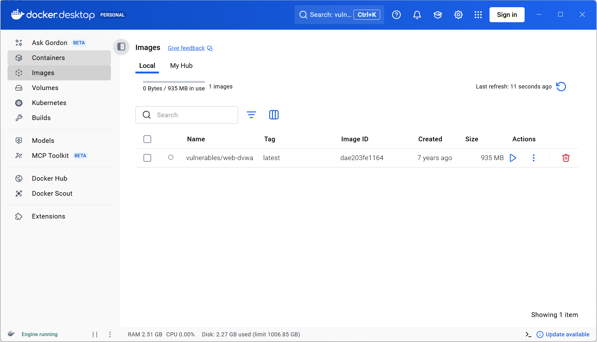
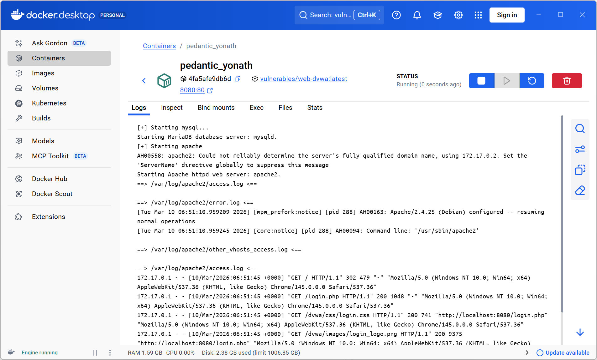
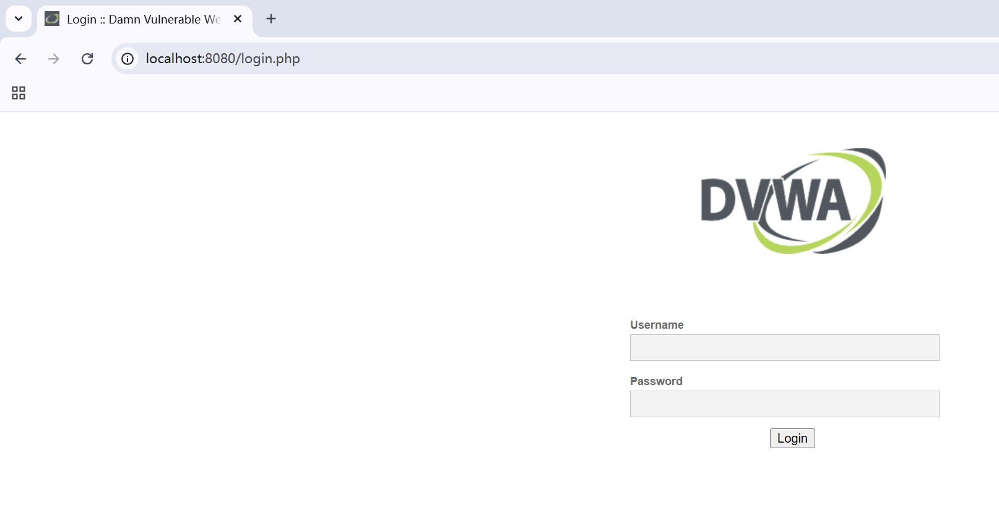
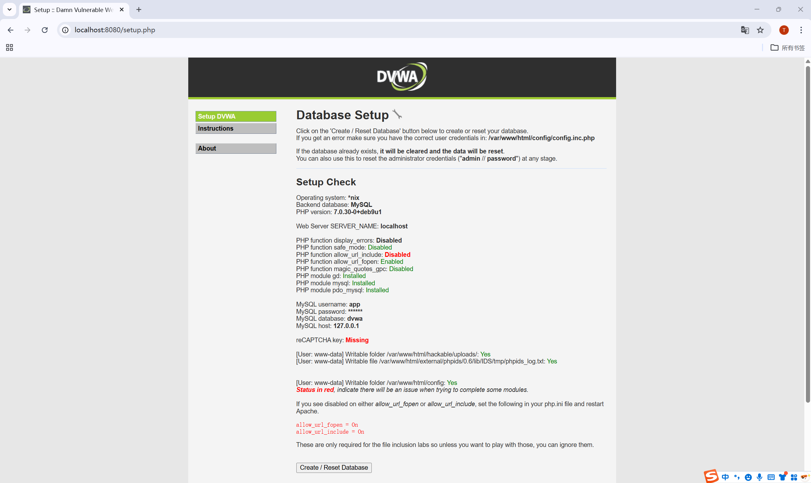
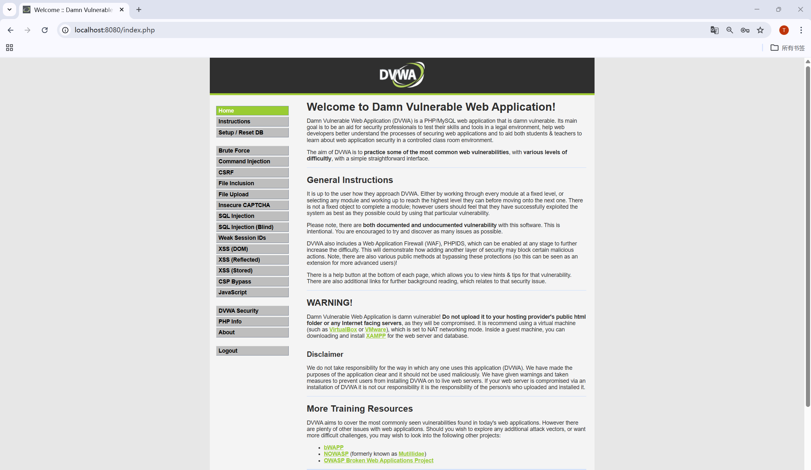

# A10:2021 - Server-Side Request Forgery (SSRF)

This project reproduces the **OWASP Top 10 A10:2021 SSRF vulnerability**.  
The initial environment is built using DVWA in Docker for reproducible setup.  
⚠️ Note: DVWA itself does not include a real SSRF module; real SSRF reproduction will use **OWASP Juice Shop** in later steps.

---

## Goals

- Understand SSRF principles
- Reproduce real vulnerability scenarios
- Develop Proof of Concept (PoC)
- Provide mitigation strategies

---

## Environment Setup (DVWA)

### Docker Image Pulled

---

### DVWA Container Running

---

### DVWA Login Page

---

### DVWA Database Initialization

---

### DVWA Login Success

---

## Environment Information

| Item | Value |
|---|---|
| Platform | Docker |
| Target Application | DVWA (Environment Setup Only) |
| Port | 8080 |
| Access URL | http://localhost:8080 |

---

## SSRF Real Vulnerability Reproduction

> ⚠️ DVWA does not include SSRF; the following steps will use **OWASP Juice Shop** or other dedicated SSRF labs to reproduce the vulnerability.

---

## Project Status

✅ Environment setup completed  
⬜ SSRF vulnerability analysis (Juice Shop)  
⬜ Exploitation & payload testing  
⬜ PoC development  
⬜ Mitigation analysis
