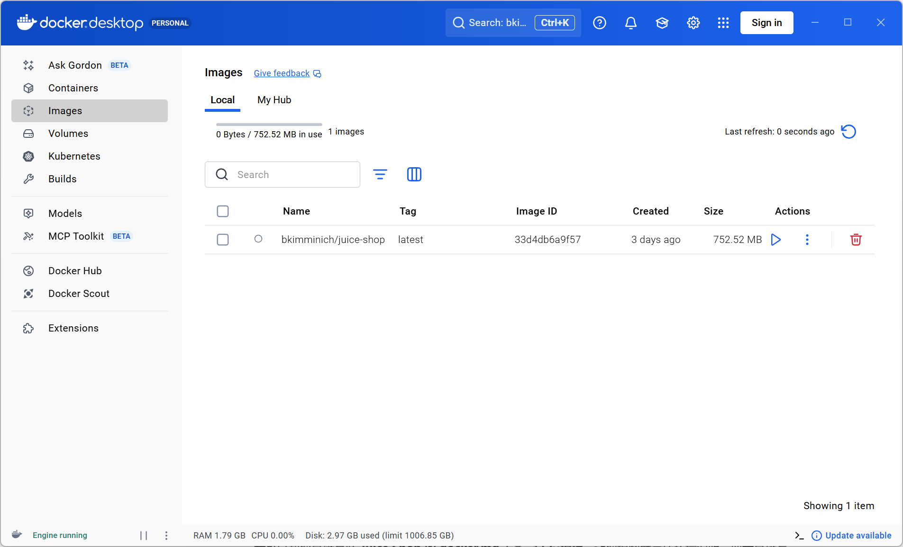
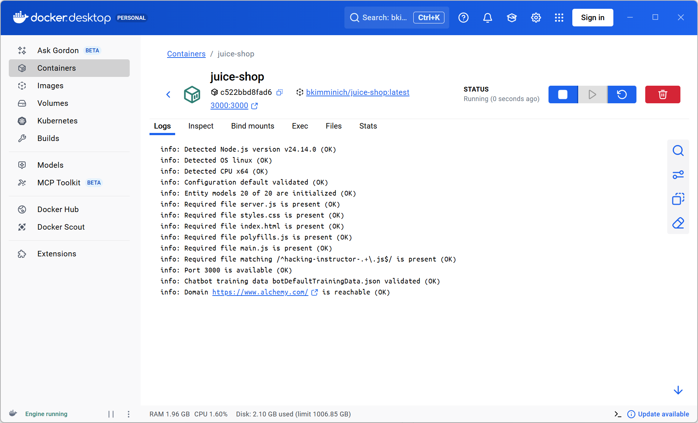
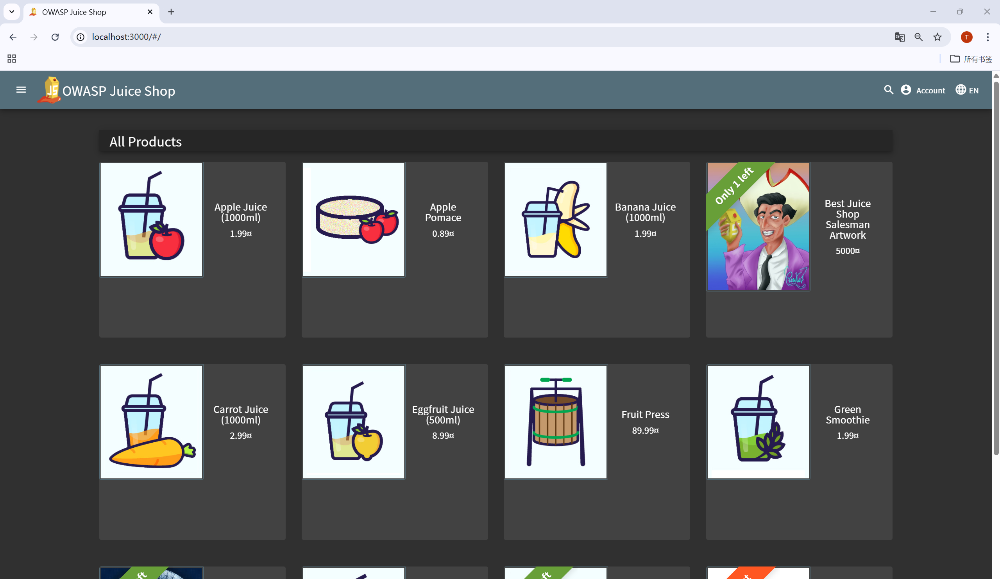

# Juice Shop 环境搭建

本文档描述了如何在 Docker 中搭建 **OWASP Juice Shop** 环境，以复现 SSRF 漏洞。

---

## 1. 拉取 Juice Shop Docker 镜像

```bash
docker pull bkimminich/juice-shop
```

**截图:** 

---

## 2. 运行 Juice Shop 容器

```bash
docker run -d --name juice-shop -p 3000:3000 bkimminich/juice-shop
```

**截图:** 

* 确保端口 `3000` 未被占用。
* 容器应以后台模式 (`-d`) 运行。

---

## 3. 访问 Juice Shop

打开浏览器访问: [http://localhost:3000](http://localhost:3000)

**截图:** 

* 已经能看到 Juice Shop 首页。
* 这表明环境已搭建完成，可以进行 SSRF 漏洞测试。
